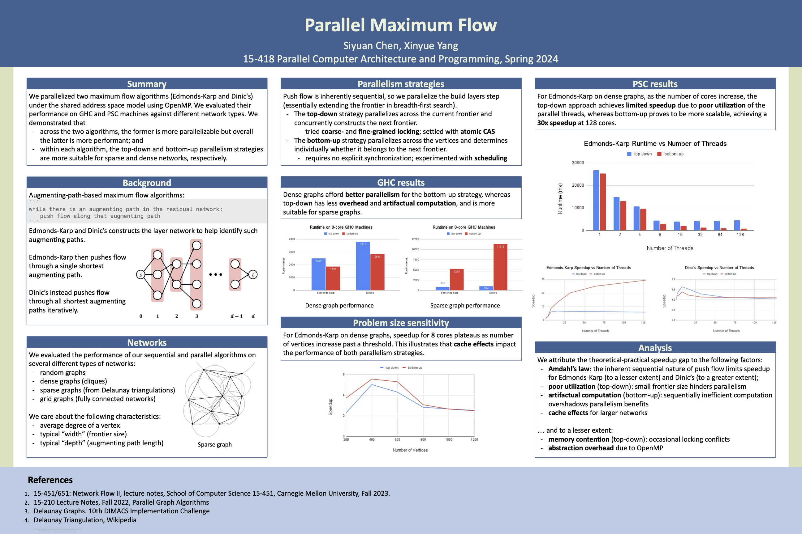

# Parallel maximum flow

## Summary

We parallelized two maximum flow algorithms
(Edmonds-Karp and Dinic's)
under the shared address space model using OpenMP.
We evaluated their performance on GHC and PSC machines against different network
types.
We demonstrated that (1) across the two algorithms,
the former is more parallelizable but overall the latter is more performant;
and (2) within each algorithm,
the top-down and bottom-up parallelism approaches are more suitable for sparse
and dense networks,
respectively.

## Links

- The project proposal can be found [here](docs/proposal.pdf).
- The milestone report can be found [here](docs/milestone.pdf).
- The final report can be found [here](docs/report.pdf).
- The poster can be found [here](docs/poster.pdf).
